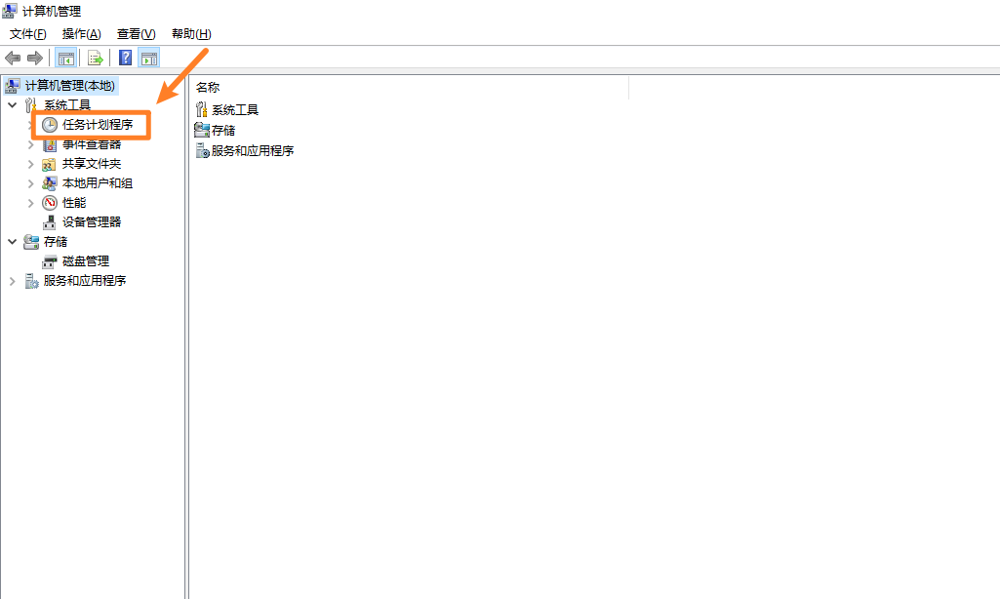
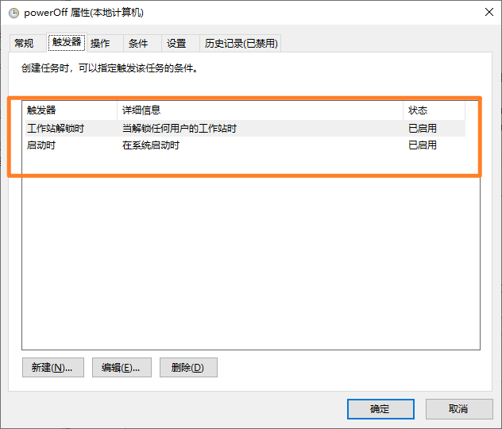
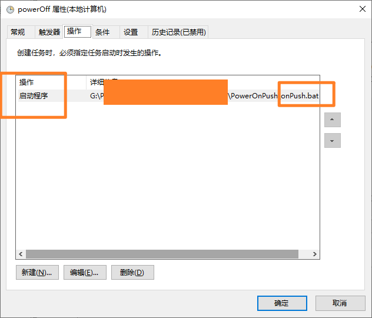

# 项目名称

> windows开机、解锁屏幕自动拍照，推送；


## 项目简介

- **目标用户**：记录一下
- **当前状态**：能用

## 功能特性

- **核心功能 1**：开机、解锁屏幕自动拍照；

- **核心功能 2**：推送  

  [ Server酱多语言调用实例]:(https://github.com/easychen/serverchan-demo)	"“Server”"

## 安装与使用

### 安装步骤

1. 克隆仓库到本地：
   ```bash
   git clone https://github.com/用户名/仓库名.git
进入项目目录：
bash
cd 仓库名
安装依赖（如有）：
bash
   ```


2.程序依赖安装完毕之后，需要设置开机自动启动;

1.  我的电脑右键管理，或者window图标右键计算机管理，在计算机管理下，在任务计划程序库下，点击创建基本任务，进行设置操作即可。 
2. 触发器
3. 操作，写明启动bat程序








## 联系方式

- **GitHub Issues**：[提交问题](https://github.com/Orange-es/PowerOnPush/issues)）